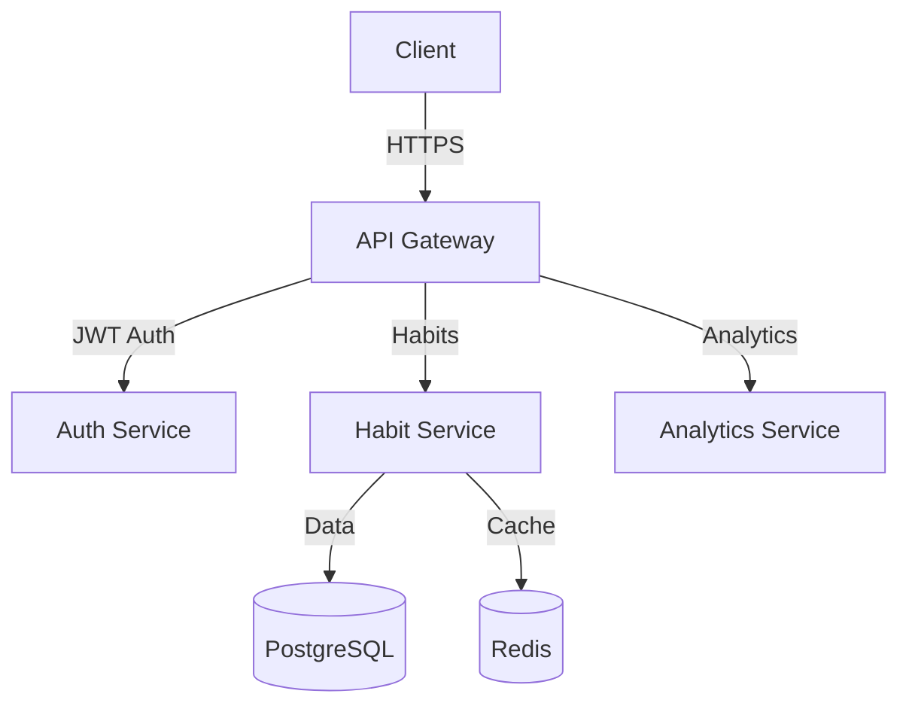

# Habit Tracking Web Application

A responsive, cross-platform web application for systematic habit tracking and data-driven insights.

## Features

- 🎯 Habit creation and configuration with customizable schedules
- 📊 Real-time progress tracking with visual indicators
- 🏆 Achievement system with gamification elements
- 📈 Advanced analytics with data visualization
- 💻 Cross-platform support with PWA capabilities
- 🔄 Offline functionality with background sync
- 🔒 Secure authentication with MFA support
- 🔔 Real-time notifications and reminders
- 💾 Data export and backup capabilities
- ⚙️ Customizable user preferences

## Technology Stack

### Frontend
- React 18.x with TypeScript 4.9.x
- Redux Toolkit 1.9.x for state management
- Material UI 5.x for component library
- React Query 4.x for data fetching
- Chart.js 4.x for data visualization
- Service Workers for offline support

### Backend
- Node.js 18.x LTS runtime
- Express 4.x for API Gateway
- PostgreSQL 14.x for primary database
- Redis 6.x for caching and sessions
- Prisma 4.x as ORM
- Jest 29.x for testing

### Infrastructure
- Docker 20.x for containerization
- Kubernetes 1.24.x for orchestration
- AWS EKS for container management
- AWS RDS for database hosting
- CloudFlare for CDN
- GitHub Actions for CI/CD

### Monitoring
- Prometheus for metrics collection
- Grafana for visualization
- ELK Stack for log management
- Sentry for error tracking

## Getting Started

### Prerequisites

- Node.js 18.x LTS
- Docker Desktop 20.x
- AWS CLI configured
- kubectl installed
- Git

### Installation

1. Clone the repository
```bash
git clone https://github.com/your-org/habit-tracker.git
cd habit-tracker
```

2. Install dependencies
```bash
npm install
```

3. Configure environment variables
```bash
cp .env.example .env
# Edit .env with your configuration
```

4. Start development environment
```bash
docker-compose up -d
npm run dev
```

### Development Setup

1. IDE Configuration
- Install recommended VS Code extensions
- Configure ESLint and Prettier
- Set up debugging configuration

2. Environment Setup
```bash
# Configure local environment
npm run setup:dev

# Initialize database
npm run db:migrate
npm run db:seed
```

3. Start Development Server
```bash
npm run dev
```

### Testing

Run different types of tests:

```bash
# Unit tests
npm run test:unit

# Integration tests
npm run test:integration

# E2E tests
npm run test:e2e

# All tests
npm run test
```

### Deployment

1. Build production assets
```bash
npm run build
```

2. Build container images
```bash
docker build -t habit-tracker:latest .
```

3. Deploy to Kubernetes
```bash
kubectl apply -f k8s/
```

## Architecture

### System Components

The application follows a microservices architecture with the following main components:

- API Gateway: Request routing and authentication
- Auth Service: User authentication and authorization
- Habit Service: Core habit management functionality
- Analytics Service: Data processing and insights
- Frontend: Progressive Web Application

### Data Flow



### Security

- OAuth 2.0 authentication with Auth0
- JWT-based authorization
- Data encryption at rest and in transit
- Rate limiting and DDoS protection
- Regular security audits and updates

### Scalability

- Horizontal scaling via Kubernetes
- Database replication and sharding
- Redis caching for performance
- CDN for static assets
- Auto-scaling based on metrics

## Contributing

### Code of Conduct

Please read our [Code of Conduct](CODE_OF_CONDUCT.md) before contributing.

### Development Process

1. Fork the repository
2. Create a feature branch
3. Implement changes
4. Write/update tests
5. Submit pull request

### Pull Request Process

1. Ensure all tests pass
2. Update documentation
3. Follow code style guidelines
4. Get review from maintainers

## License

This project is licensed under the MIT License - see the [LICENSE](LICENSE) file for details.

## Support

For support, please:
- Check our [Documentation](docs/README.md)
- Create an [Issue](https://github.com/your-org/habit-tracker/issues)
- Join our [Discord Community](https://discord.gg/habit-tracker)

## Acknowledgments

- All contributors who have helped shape this project
- Open source community for the amazing tools and libraries
- Our users for valuable feedback and suggestions