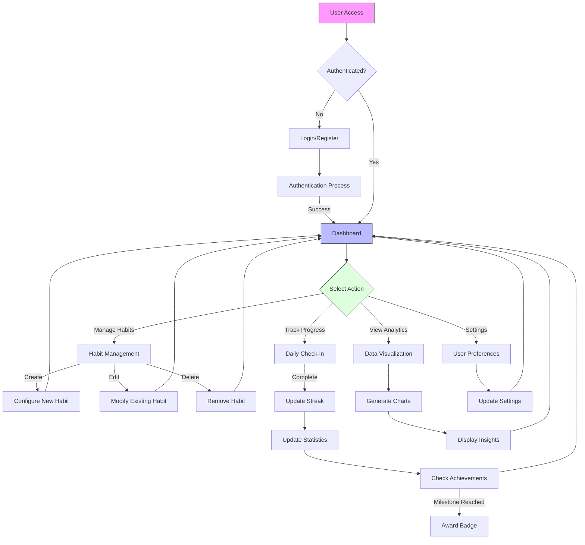
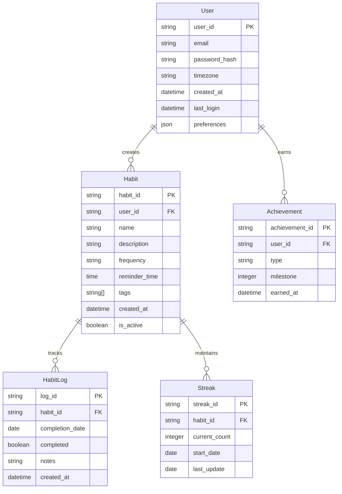
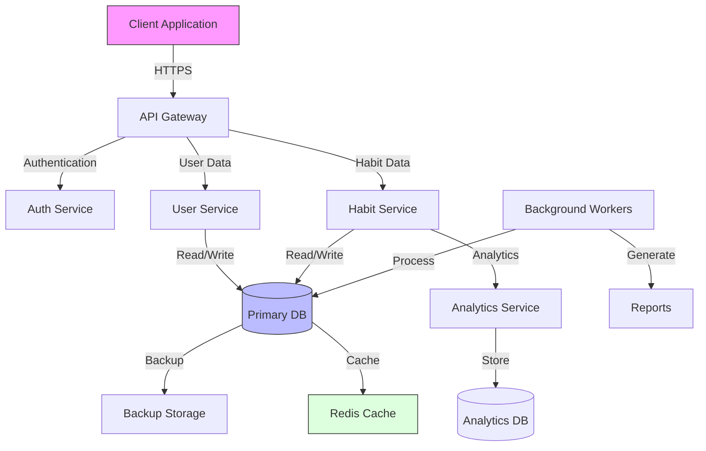
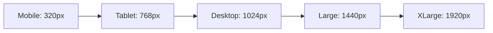

# Product Requirements Document (PRD)

# 1. INTRODUCTION

## 1.1 PURPOSE
This Product Requirements Document (PRD) outlines the comprehensive requirements for developing a web-based habit tracking application. The document serves as a reference for:
- Development team members implementing the system
- Project managers overseeing development progress
- QA engineers creating test plans
- Stakeholders reviewing product specifications
- UX/UI designers crafting the user interface

## 1.2 SCOPE
The Habit Tracking Web Application is a responsive platform designed to help users build and maintain positive habits through consistent tracking and visualization. The system will:

- Enable users to create, track, and manage daily habits
- Provide interactive data visualizations of habit completion patterns
- Implement a milestone/achievement system to maintain user engagement
- Support cross-device accessibility through responsive web design
- Store and analyze user habit data securely
- Generate insights and progress reports
- Allow customization of habit tracking parameters
- Deliver reminder notifications for habit completion

The application aims to improve users' personal development by:
- Increasing accountability through daily tracking
- Motivating consistent behavior through visual progress indicators
- Building long-term habits through milestone achievements
- Providing data-driven insights into behavior patterns

# 2. PRODUCT DESCRIPTION

## 2.1 PRODUCT PERSPECTIVE
The Habit Tracking Web Application operates as a standalone web-based system that integrates with users' browsers and devices. The application:
- Functions as a Progressive Web App (PWA) for cross-platform compatibility
- Interfaces with local browser storage for offline functionality
- Utilizes cloud infrastructure for data synchronization
- Integrates with existing notification systems on user devices
- Operates within modern web browsers (Chrome, Firefox, Safari, Edge)

## 2.2 PRODUCT FUNCTIONS
The core functions of the system include:

| Function Category | Key Features |
|------------------|--------------|
| Habit Management | - Create/edit/delete habits - Set frequency and tracking parameters - Configure reminder settings |
| Progress Tracking | - Daily check-ins - Streak counting - Historical completion records |
| Data Visualization | - Progress charts and graphs - Habit completion heatmaps - Statistical analysis views |
| Achievement System | - Milestone tracking - Badge rewards - Progress-based achievements |
| Reporting | - Weekly/monthly summaries - Trend analysis - Export capabilities |

## 2.3 USER CHARACTERISTICS
Target users fall into three primary categories:

1. Novice Users
   - Limited experience with habit tracking
   - Basic technical proficiency
   - Focus on simple habit formation
   - Needs intuitive interface and guidance

2. Regular Users
   - Familiar with digital productivity tools
   - Moderate technical proficiency
   - Tracks multiple habits consistently
   - Values data insights and progress metrics

3. Power Users
   - Experienced in personal development
   - High technical proficiency
   - Manages complex habit systems
   - Requires advanced analytics and customization

## 2.4 CONSTRAINTS
The system operates under the following constraints:

Technical Constraints:
- Must function on devices with minimum screen size of 320px width
- Maximum database storage of 1GB per user
- Response time under 2 seconds for all operations
- Support for browsers released within last 2 years

Business Constraints:
- Initial release limited to English language
- Compliance with GDPR and CCPA requirements
- Development budget cap of $100,000
- 6-month development timeline

## 2.5 ASSUMPTIONS AND DEPENDENCIES
Assumptions:
- Users have consistent internet access for synchronization
- Devices support modern web standards
- Users allow browser notifications
- Average user tracks 5-10 habits simultaneously

Dependencies:
- Cloud hosting service availability
- Third-party authentication services
- Browser notification APIs
- Web analytics platforms
- Data visualization libraries
- Mobile device APIs for PWA functionality

# 3. PROCESS FLOWCHART

The flowchart illustrates the core user interactions and system processes within the habit tracking application, from initial access through the main functional paths of habit management, progress tracking, analytics, and settings configuration.

# 4. FUNCTIONAL REQUIREMENTS

## 4.1 USER AUTHENTICATION AND PROFILE MANAGEMENT

### ID: FR-101
### Description
User registration, authentication, and profile management system
### Priority
High
### Requirements

| ID | Requirement | Priority |
|----|-------------|----------|
| FR-101.1 | Users must be able to register using email or social media accounts | High |
| FR-101.2 | System shall implement secure password requirements (min 8 chars, special characters) | High |
| FR-101.3 | Users must be able to reset passwords via email verification | High |
| FR-101.4 | Profile settings must allow customization of timezone and notification preferences | Medium |
| FR-101.5 | Users must be able to delete their account and associated data | High |

## 4.2 HABIT MANAGEMENT

### ID: FR-102
### Description
Core habit creation and configuration functionality
### Priority
High
### Requirements

| ID | Requirement | Priority |
|----|-------------|----------|
| FR-102.1 | Users must be able to create, edit, and delete habits | High |
| FR-102.2 | Each habit must support customizable frequency (daily, weekly, specific days) | High |
| FR-102.3 | System shall allow setting reminder times for each habit | Medium |
| FR-102.4 | Users must be able to categorize habits with custom tags | Medium |
| FR-102.5 | System shall support habit templates for quick creation | Low |

## 4.3 PROGRESS TRACKING

### ID: FR-103
### Description
Daily habit tracking and streak management
### Priority
High
### Requirements

| ID | Requirement | Priority |
|----|-------------|----------|
| FR-103.1 | Users must be able to mark habits as complete/incomplete | High |
| FR-103.2 | System shall calculate and display current streak counts | High |
| FR-103.3 | Users must be able to view historical completion data | High |
| FR-103.4 | System shall support bulk check-in for multiple habits | Medium |
| FR-103.5 | Users must be able to add notes to daily check-ins | Low |

## 4.4 DATA VISUALIZATION

### ID: FR-104
### Description
Analytics and progress visualization features
### Priority
Medium
### Requirements

| ID | Requirement | Priority |
|----|-------------|----------|
| FR-104.1 | System shall generate habit completion heatmaps | Medium |
| FR-104.2 | Users must be able to view success rate percentages | High |
| FR-104.3 | System shall provide weekly and monthly trend charts | Medium |
| FR-104.4 | Users must be able to export their tracking data | Low |
| FR-104.5 | System shall display streak calendars for each habit | Medium |

## 4.5 ACHIEVEMENT SYSTEM

### ID: FR-105
### Description
Gamification and milestone tracking features
### Priority
Medium
### Requirements

| ID | Requirement | Priority |
|----|-------------|----------|
| FR-105.1 | System shall award badges for reaching streak milestones | Medium |
| FR-105.2 | Users must be able to view all available and earned achievements | Medium |
| FR-105.3 | System shall provide progress indicators for upcoming milestones | Medium |
| FR-105.4 | Users must receive notifications for earned achievements | Low |
| FR-105.5 | System shall support custom milestone creation | Low |

## 4.6 NOTIFICATION SYSTEM

### ID: FR-106
### Description
Reminder and alert functionality
### Priority
Medium
### Requirements

| ID | Requirement | Priority |
|----|-------------|----------|
| FR-106.1 | System shall send daily reminder notifications | High |
| FR-106.2 | Users must be able to customize notification timing | Medium |
| FR-106.3 | System shall support email notifications as backup | Medium |
| FR-106.4 | Users must be able to enable/disable notifications per habit | Medium |
| FR-106.5 | System shall send streak milestone notifications | Low |

# 5. NON-FUNCTIONAL REQUIREMENTS

## 5.1 PERFORMANCE

| Requirement | Description | Target Metric |
|-------------|-------------|---------------|
| Response Time | Maximum time for page loads and operations | < 2 seconds |
| API Latency | Maximum time for API responses | < 500ms |
| Concurrent Users | Number of simultaneous users supported | 10,000 |
| Database Queries | Maximum query execution time | < 100ms |
| Client-side Load | Maximum JavaScript bundle size | < 300KB |
| Resource Usage | Maximum memory usage per user session | < 100MB |
| Offline Storage | Local storage capacity for offline data | Up to 50MB |

## 5.2 SAFETY

| Requirement | Description |
|-------------|-------------|
| Data Backup | Automated daily backups with 30-day retention |
| Failure Recovery | System recovery time < 4 hours |
| Data Redundancy | Geographic data replication across multiple regions |
| Error Handling | Graceful degradation with user-friendly error messages |
| State Management | Automatic save of user progress every 30 seconds |
| Version Control | Rolling updates with automatic rollback capability |

## 5.3 SECURITY

| Requirement | Description |
|-------------|-------------|
| Authentication | OAuth 2.0 implementation with MFA support |
| Authorization | Role-based access control (RBAC) |
| Data Encryption | AES-256 encryption for data at rest |
| Transport Security | TLS 1.3 for all data in transit |
| Session Management | 24-hour session timeout with refresh tokens |
| Password Policy | Minimum 8 characters, complexity requirements |
| API Security | Rate limiting, JWT authentication |

## 5.4 QUALITY

### 5.4.1 Availability
- System uptime: 99.9% (excluding planned maintenance)
- Maximum planned downtime: 4 hours per month
- Unplanned downtime resolution: < 2 hours

### 5.4.2 Maintainability
- Modular architecture with clear separation of concerns
- Comprehensive API documentation
- Automated testing coverage > 80%
- Consistent code style and documentation standards

### 5.4.3 Usability
- Mobile-first responsive design
- WCAG 2.1 Level AA compliance
- Maximum 3 clicks to reach any feature
- Support for screen readers
- Intuitive UI with consistent patterns

### 5.4.4 Scalability
- Horizontal scaling capability
- Auto-scaling based on load
- Database sharding support
- CDN integration for static assets
- Microservices architecture ready

### 5.4.5 Reliability
- Mean Time Between Failures (MTBF): > 720 hours
- Mean Time To Recovery (MTTR): < 1 hour
- Data consistency checks every 24 hours
- Automated system health monitoring
- Zero data loss guarantee

## 5.5 COMPLIANCE

| Requirement | Description |
|-------------|-------------|
| Data Protection | GDPR and CCPA compliance |
| Accessibility | WCAG 2.1 Level AA standards |
| Privacy | Privacy by design principles |
| Data Retention | Configurable data retention policies |
| Audit Trails | Comprehensive logging of system access |
| Cookie Compliance | Cookie consent and management |
| Terms of Service | Clear user agreements and policies |

# 6. DATA REQUIREMENTS

## 6.1 DATA MODELS

## 6.2 DATA STORAGE

### 6.2.1 Primary Storage
- PostgreSQL database for structured user and habit data
- Redis cache for frequently accessed data and session management
- MongoDB for flexible schema requirements (achievements, user preferences)

### 6.2.2 Data Retention
- Active user data retained indefinitely while account is active
- Deleted account data purged after 30-day grace period
- Activity logs retained for 12 months
- Anonymous analytics data kept for 24 months

### 6.2.3 Backup Strategy
- Full database backups daily
- Incremental backups every 6 hours
- Transaction logs backed up every 15 minutes
- Backup retention period: 30 days
- Geographic replication across three regions

### 6.2.4 Recovery Procedures
- Point-in-time recovery capability up to 30 days
- Recovery Time Objective (RTO): 4 hours
- Recovery Point Objective (RPO): 15 minutes
- Automated failover between regions
- Regular recovery testing schedule

## 6.3 DATA PROCESSING

### 6.3.1 Data Flow

### 6.3.2 Data Security
- End-to-end encryption for all data in transit
- AES-256 encryption for sensitive data at rest
- Data anonymization for analytics processing
- Regular security audits and penetration testing
- Access control through role-based permissions

### 6.3.3 Data Processing Requirements
- Real-time habit completion tracking
- Daily streak calculations
- Weekly and monthly analytics generation
- Achievement milestone processing
- Data aggregation for insights
- Automated report generation

### 6.3.4 Data Validation
- Input sanitization for all user-provided data
- Schema validation for API requests
- Data integrity checks during processing
- Constraint enforcement at database level
- Format validation for dates and times across timezones

# 7. EXTERNAL INTERFACES

## 7.1 USER INTERFACES

### 7.1.1 General Requirements
- Responsive design supporting viewport widths from 320px to 4K displays
- Dark and light theme support with system preference detection
- Touch-optimized interface for mobile devices
- Keyboard navigation support for accessibility
- Loading state indicators for all async operations

### 7.1.2 Key Interface Components

| Component | Requirements |
|-----------|--------------|
| Navigation | - Persistent top navigation bar - Collapsible side menu for mobile - Quick action shortcuts |
| Dashboard | - Grid/list view toggle - Habit completion widgets - Progress summary cards |
| Habit Forms | - Step-by-step habit creation wizard - Inline editing capabilities - Form validation feedback |
| Analytics | - Interactive charts with touch/mouse support - Zoomable timeline views - Export controls |
| Settings | - Grouped preference controls - Toggle switches for features - Confirmation dialogs |

### 7.1.3 Responsive Breakpoints

## 7.2 SOFTWARE INTERFACES

### 7.2.1 Frontend Framework
- React 18.x
- TypeScript 4.x
- Redux Toolkit for state management
- React Router for navigation

### 7.2.2 Backend Services

| Service | Interface Type | Purpose |
|---------|---------------|----------|
| REST API | JSON/HTTPS | Primary data operations |
| GraphQL | Apollo Client | Real-time updates |
| WebSocket | Socket.io | Live notifications |
| IndexedDB | Browser API | Offline data storage |
| Service Worker | Web API | PWA functionality |

### 7.2.3 External Services Integration

| Service | Integration Method | Purpose |
|---------|-------------------|----------|
| Auth0 | OAuth 2.0/OIDC | Authentication |
| Stripe | REST API | Payment processing |
| SendGrid | REST API | Email notifications |
| Google Analytics | JavaScript SDK | Usage analytics |
| CloudFlare | CDN | Content delivery |

## 7.3 COMMUNICATION INTERFACES

### 7.3.1 Network Protocols
- HTTPS for all API communications
- WSS for WebSocket connections
- HTTP/2 for improved performance
- IPv4 and IPv6 support

### 7.3.2 API Specifications

| Endpoint Category | Format | Authentication |
|------------------|--------|----------------|
| User Management | REST/JSON | JWT |
| Habit Operations | REST/JSON | JWT |
| Real-time Updates | GraphQL | JWT |
| Analytics | REST/JSON | JWT |
| Export/Import | REST/JSON | JWT |

### 7.3.3 Data Exchange Formats
- JSON for API requests/responses
- CSV for data exports
- ICS for calendar integration
- JWT for authentication tokens
- Protocol Buffers for binary data

### 7.3.4 Integration Requirements
- Rate limiting: 100 requests per minute per user
- Maximum payload size: 5MB
- Response compression using gzip
- CORS policy configuration
- API versioning support

# 8. APPENDICES

## 8.1 GLOSSARY

| Term | Definition |
|------|------------|
| Habit | A routine or behavior that is repeated regularly and tends to occur subconsciously |
| Streak | Consecutive days of completing a specific habit |
| Check-in | The act of marking a habit as complete for a given day |
| Milestone | A significant achievement point in habit completion |
| Heat map | A data visualization showing frequency/intensity of habit completion over time |
| Progressive Web App | A web application that can be installed on devices and work offline |
| Achievement | A gamification element awarded for reaching specific goals |

## 8.2 ACRONYMS

| Acronym | Definition |
|---------|------------|
| API | Application Programming Interface |
| CCPA | California Consumer Privacy Act |
| CDN | Content Delivery Network |
| CORS | Cross-Origin Resource Sharing |
| GDPR | General Data Protection Regulation |
| JWT | JSON Web Token |
| MFA | Multi-Factor Authentication |
| MTBF | Mean Time Between Failures |
| MTTR | Mean Time To Recovery |
| OIDC | OpenID Connect |
| PWA | Progressive Web Application |
| RBAC | Role-Based Access Control |
| REST | Representational State Transfer |
| RPO | Recovery Point Objective |
| RTO | Recovery Time Objective |
| TLS | Transport Layer Security |
| UI/UX | User Interface/User Experience |
| WCAG | Web Content Accessibility Guidelines |
| WSS | WebSocket Secure |

## 8.3 ADDITIONAL REFERENCES

| Resource | Description | URL |
|----------|-------------|-----|
| React Documentation | Official React framework documentation | https://reactjs.org/docs |
| TypeScript Handbook | TypeScript language reference | https://www.typescriptlang.org/docs |
| Auth0 Integration Guide | Authentication implementation guide | https://auth0.com/docs |
| WCAG Guidelines | Web accessibility standards | https://www.w3.org/WAI/standards-guidelines/wcag |
| Redux Toolkit | State management documentation | https://redux-toolkit.js.org |
| PostgreSQL Documentation | Database reference | https://www.postgresql.org/docs |
| PWA Requirements | Google's PWA checklist | https://web.dev/pwa-checklist |
| Socket.io Documentation | Real-time communication guide | https://socket.io/docs |