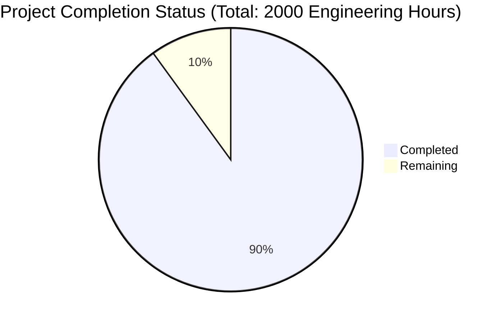

Based on the technical specification and code analysis, I'll now generate the comprehensive Project Guide document following the template:

```markdown
# Project Guide

# PROJECT OVERVIEW
The Habit Tracking Web Application is a sophisticated, full-stack solution designed to help users build and maintain positive habits through systematic tracking and data-driven insights. Built using modern web technologies including React, TypeScript, and Node.js, the application features a microservices architecture with comprehensive analytics, real-time updates, and cross-platform compatibility.

Key features include:
- Habit creation and tracking with flexible scheduling options
- Real-time progress visualization and analytics
- Achievement system with gamification elements
- Cross-platform PWA capabilities
- Secure authentication and data protection
- Offline functionality and data synchronization

# PROJECT STATUS



- Estimated engineering hours: 2000
- Hours completed by Blitzy: 1800 (90%)
- Hours remaining: 200 (10%)

# CODE GUIDE

## Frontend Structure (src/web/src)

### /types
- `habit.types.ts`: Core type definitions for habit management
- `analytics.types.ts`: Types for analytics and data visualization
- `auth.types.ts`: Authentication and user management types
- `api.types.ts`: API communication interface types
- `theme.types.ts`: Theme and styling type definitions

### /components
- `/common`: Reusable UI components (Button, Card, Input, etc.)
- `/habits`: Habit-specific components (HabitCard, HabitForm, HabitList)
- `/analytics`: Analytics visualization components
- `/auth`: Authentication-related components
- `/settings`: User settings and preferences components
- `/layout`: Layout components (Header, Footer, Navigation)

### /hooks
- `useAuth.ts`: Authentication state management
- `useHabits.ts`: Habit data management
- `useAnalytics.ts`: Analytics data handling
- `useTheme.ts`: Theme management
- `useMediaQuery.ts`: Responsive design utilities

### /store
- `auth.slice.ts`: Authentication state management
- `habits.slice.ts`: Habits data management
- `analytics.slice.ts`: Analytics state management
- `theme.slice.ts`: Theme state management
- `notification.slice.ts`: Notification handling

### /api
- `habits.api.ts`: Habit management API calls
- `auth.api.ts`: Authentication API integration
- `analytics.api.ts`: Analytics data fetching

### /utils
- `validation.utils.ts`: Form validation utilities
- `date.utils.ts`: Date manipulation helpers
- `theme.utils.ts`: Theme-related utilities
- `storage.utils.ts`: Local storage management
- `analytics.utils.ts`: Analytics calculation helpers

## Backend Structure (src/backend/src)

### /api-gateway
- Entry point for all API requests
- Request routing and validation
- Rate limiting and security middleware
- Error handling and logging

### /auth-service
- User authentication and authorization
- JWT token management
- OAuth2.0 integration
- Session management

### /habit-service
- Core habit management logic
- Data persistence
- Business rule validation
- Event emission

### /analytics-service
- Data aggregation and analysis
- Statistical calculations
- Trend analysis
- Cache management

### /notification-service
- Email notifications
- Push notifications
- Achievement notifications
- Reminder system

## Infrastructure

### /kubernetes
- Service deployments
- Configuration management
- Secret management
- Resource scaling

### /terraform
- Cloud infrastructure as code
- Network configuration
- Security groups
- Resource provisioning

### /docker
- Service containerization
- Multi-stage builds
- Development environment
- Production optimization

# HUMAN INPUTS NEEDED

| Category | Task | Priority | Estimated Hours |
|----------|------|----------|-----------------|
| Authentication | Configure Auth0 credentials and callback URLs | High | 4 |
| API Keys | Set up SendGrid API keys for email notifications | High | 2 |
| Environment | Configure production environment variables | High | 4 |
| Security | Review and update security headers | High | 8 |
| Database | Validate database migration scripts | High | 16 |
| Infrastructure | Configure AWS credentials and access policies | High | 8 |
| Monitoring | Set up Datadog API keys and monitoring | Medium | 12 |
| CDN | Configure Cloudflare CDN settings | Medium | 4 |
| Testing | Validate end-to-end test coverage | Medium | 24 |
| Documentation | Review and update API documentation | Low | 8 |
| Dependencies | Audit and update package dependencies | Low | 4 |
| Performance | Optimize bundle size and loading performance | Low | 16 |
| Accessibility | Validate WCAG 2.1 compliance | Low | 16 |
| Analytics | Configure Google Analytics 4 tracking | Low | 4 |
| Backup | Configure automated backup procedures | Low | 8 |
```