# Technical Specifications

# 1. INTRODUCTION

## 1.1 EXECUTIVE SUMMARY

The Habit Tracking Web Application is a responsive, cross-platform solution designed to help users build and maintain positive habits through systematic tracking and data-driven insights. This system addresses the fundamental challenge of habit formation by providing users with consistent tracking mechanisms, visual progress indicators, and achievement-based motivation.

The application serves individual users seeking personal development, with a focus on delivering an intuitive, engaging experience that promotes long-term behavioral change through data visualization and gamification elements. The expected impact includes increased user success rates in habit formation, improved adherence to personal goals, and measurable behavioral changes through systematic tracking and reinforcement.

## 1.2 SYSTEM OVERVIEW

### Project Context

| Aspect | Description |
|--------|-------------|
| Market Position | First-to-market comprehensive web-based habit tracking solution with cross-platform capabilities |
| Target Market | Individual users seeking personal development and behavioral change tools |
| Competitive Edge | Integration of data visualization, gamification, and cross-device synchronization |
| Enterprise Integration | Standalone system with future API capabilities for third-party integration |

### High-Level Description

| Component | Implementation |
|-----------|----------------|
| Frontend Architecture | Progressive Web Application using React and TypeScript |
| Backend Services | RESTful API architecture with microservices design |
| Data Storage | PostgreSQL for structured data, Redis for caching |
| Authentication | OAuth 2.0 with multi-factor authentication support |
| Analytics | Real-time data processing and visualization engine |

### Success Criteria

| Metric | Target |
|--------|--------|
| User Adoption | 10,000 active users within 6 months |
| Retention Rate | 60% user retention after 3 months |
| System Uptime | 99.9% availability |
| User Satisfaction | 4.5/5 average user rating |
| Performance | < 2 second response time for all operations |

## 1.3 SCOPE

### In-Scope Elements

#### Core Features and Functionalities

| Category | Features |
|----------|-----------|
| Habit Management | - Habit creation and configuration<br>- Progress tracking<br>- Reminder system |
| Data Visualization | - Progress charts<br>- Completion heatmaps<br>- Trend analysis |
| User Engagement | - Achievement system<br>- Milestone tracking<br>- Streak monitoring |
| Cross-Platform | - Responsive web design<br>- PWA capabilities<br>- Offline functionality |

#### Implementation Boundaries

| Boundary Type | Coverage |
|--------------|----------|
| User Groups | Individual users (non-enterprise) |
| Geographic Coverage | Global deployment, English language |
| Data Domains | Personal habit tracking and analytics |
| Device Support | Modern web browsers, mobile devices |

### Out-of-Scope Elements

- Enterprise team management features
- Native mobile applications
- Social network integration
- Multi-language support
- Custom API integrations
- Machine learning recommendations
- Group habit tracking
- Video content integration
- Wearable device synchronization
- Custom reporting tools

# 2. SYSTEM ARCHITECTURE

## 2.1 HIGH-LEVEL ARCHITECTURE

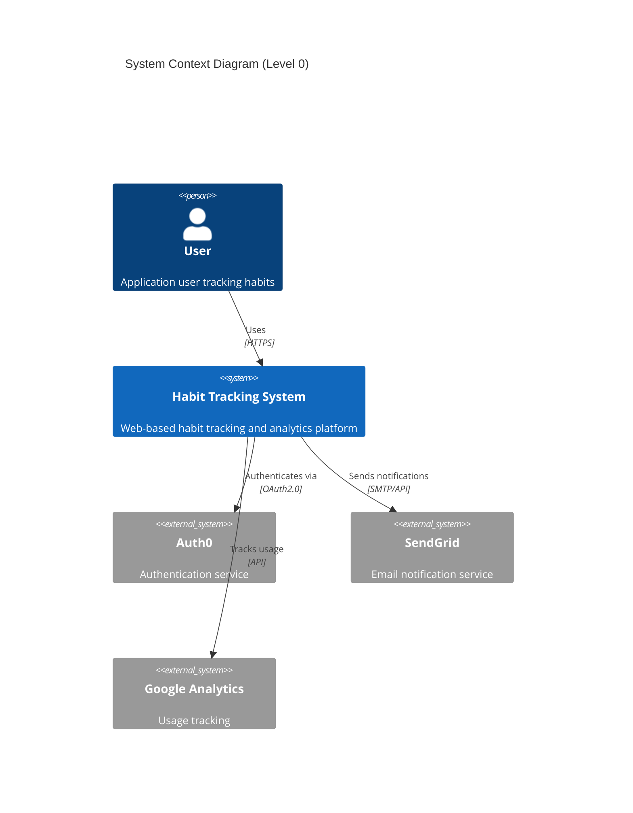

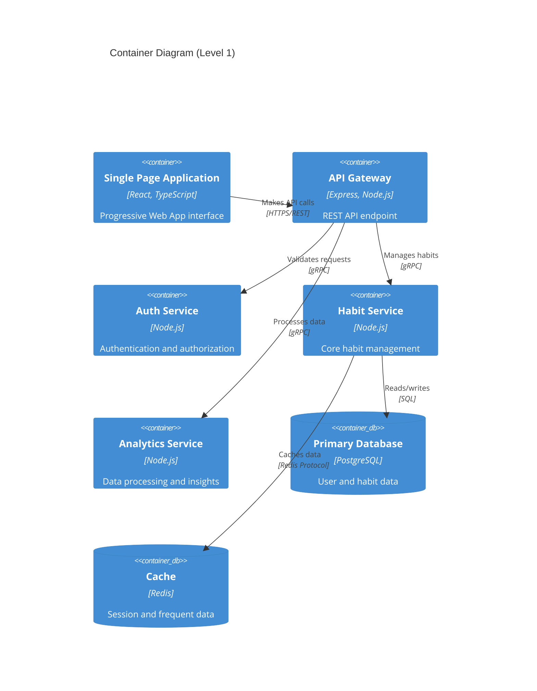

## 2.2 COMPONENT DETAILS

### 2.2.1 Frontend Components

| Component | Purpose | Technology | Scaling |
|-----------|---------|------------|----------|
| Web Client | User interface | React, TypeScript | CDN distribution |
| State Management | Application state | Redux Toolkit | Client-side |
| API Client | Data fetching | Axios, React Query | Request caching |
| PWA Shell | Offline support | Service Workers | Browser cache |

### 2.2.2 Backend Services

| Service | Purpose | Technology | Scaling |
|---------|---------|------------|----------|
| API Gateway | Request routing | Express.js | Horizontal |
| Auth Service | Authentication | Node.js, JWT | Stateless |
| Habit Service | Core business logic | Node.js | Horizontal |
| Analytics Service | Data processing | Node.js | Vertical |
| Notification Service | User alerts | Node.js | Queue-based |

### 2.2.3 Data Storage

| Store | Purpose | Technology | Scaling |
|-------|---------|------------|----------|
| Primary DB | Persistent storage | PostgreSQL | Replication |
| Cache | Performance | Redis | Cluster |
| Search | Full-text search | Elasticsearch | Sharding |
| File Storage | User uploads | S3-compatible | Distributed |

## 2.3 TECHNICAL DECISIONS

### 2.3.1 Architecture Style

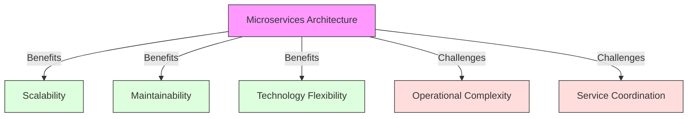

### 2.3.2 Communication Patterns

| Pattern | Use Case | Implementation |
|---------|----------|----------------|
| REST | CRUD operations | Express.js |
| WebSocket | Real-time updates | Socket.io |
| Message Queue | Async processing | RabbitMQ |
| gRPC | Service-to-service | Protocol Buffers |

## 2.4 CROSS-CUTTING CONCERNS

### 2.4.1 Monitoring Architecture

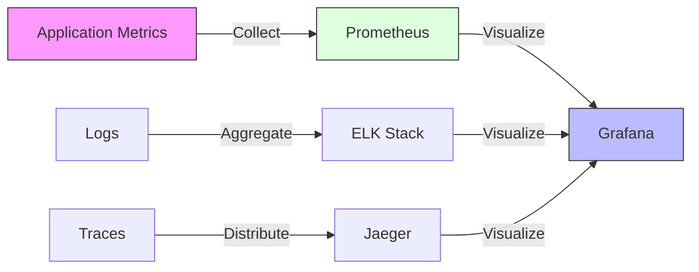

### 2.4.2 Security Architecture

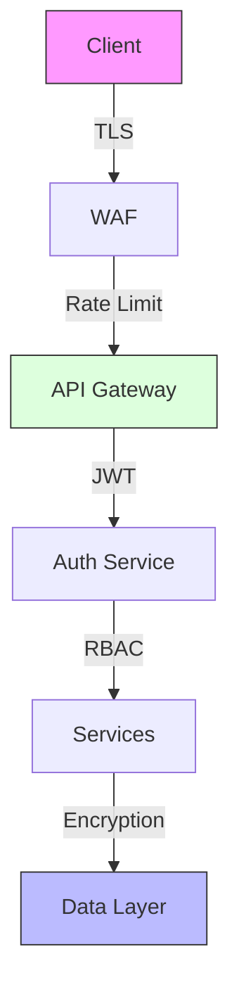

### 2.4.3 Deployment Architecture

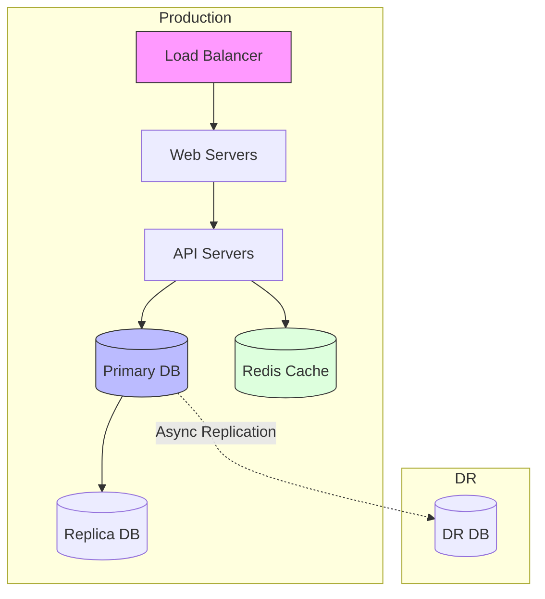

## 2.5 PERFORMANCE CONSIDERATIONS

| Component | Target Metric | Implementation |
|-----------|--------------|----------------|
| API Response | < 100ms | Redis caching |
| Page Load | < 2s | CDN, compression |
| Database | < 10ms | Index optimization |
| Search | < 200ms | Elasticsearch |
| Background Jobs | < 5min | Worker pools |

# 3. SYSTEM COMPONENTS ARCHITECTURE

## 3.1 USER INTERFACE DESIGN

### 3.1.1 Design Specifications

| Aspect | Requirements |
|--------|--------------|
| Visual Hierarchy | - F-pattern layout for desktop<br>- Z-pattern layout for mobile<br>- Maximum 3 levels of information hierarchy |
| Component Library | - Material Design components<br>- Custom themed components<br>- Atomic design methodology |
| Responsive Design | - Mobile-first approach<br>- Fluid typography (16-24px base)<br>- Breakpoints: 320px, 768px, 1024px, 1440px |
| Accessibility | - WCAG 2.1 Level AA compliance<br>- ARIA landmarks and labels<br>- Keyboard navigation support |
| Browser Support | - Chrome (last 2 versions)<br>- Firefox (last 2 versions)<br>- Safari (last 2 versions)<br>- Edge (last 2 versions) |
| Theme Support | - System preference detection<br>- Manual theme toggle<br>- Persistent theme selection |

### 3.1.2 Interface Elements

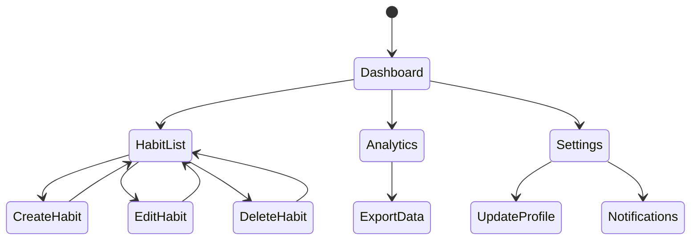

### 3.1.3 Critical User Flows

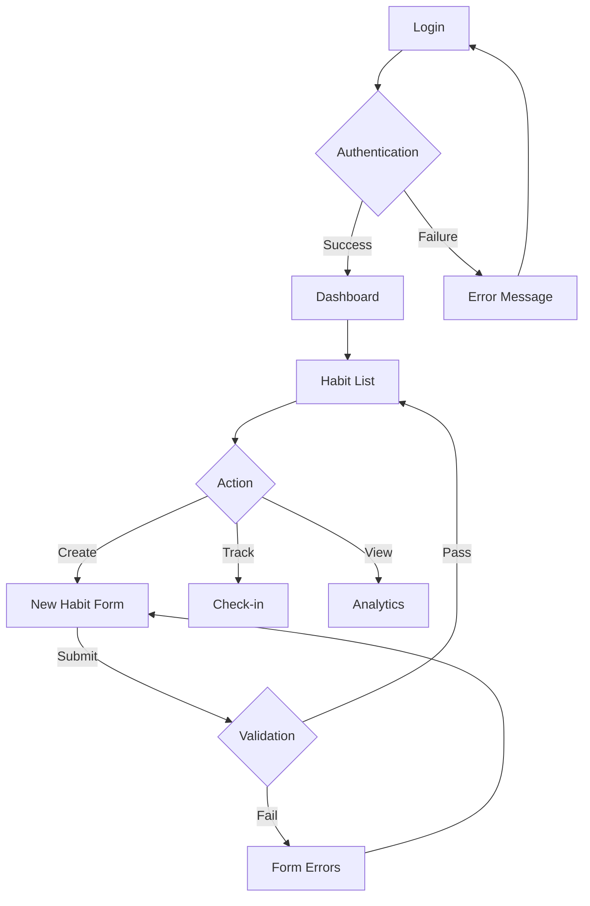

## 3.2 DATABASE DESIGN

### 3.2.1 Schema Design

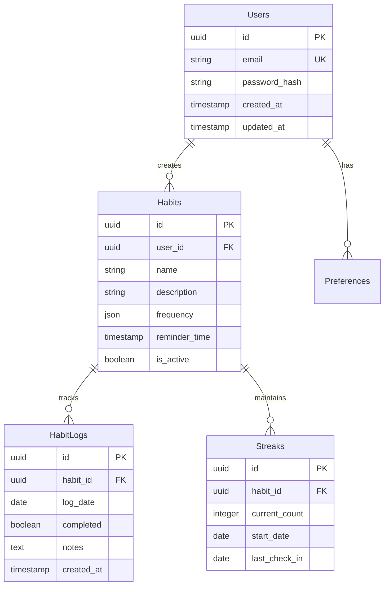

### 3.2.2 Data Management Strategy

| Component | Strategy |
|-----------|----------|
| Migrations | - Versioned migrations with rollback<br>- Blue-green deployment support<br>- Data validation pre/post migration |
| Versioning | - Schema versioning with semantic versioning<br>- Backward compatibility for 2 versions<br>- Version metadata tracking |
| Archival | - Monthly archival of inactive habits<br>- Yearly archival of completed habits<br>- Compressed storage format |
| Retention | - Active data: Indefinite<br>- Archived data: 2 years<br>- Audit logs: 1 year |
| Privacy | - Data encryption at rest<br>- Column-level encryption for PII<br>- Data anonymization for analytics |

## 3.3 API DESIGN

### 3.3.1 API Architecture

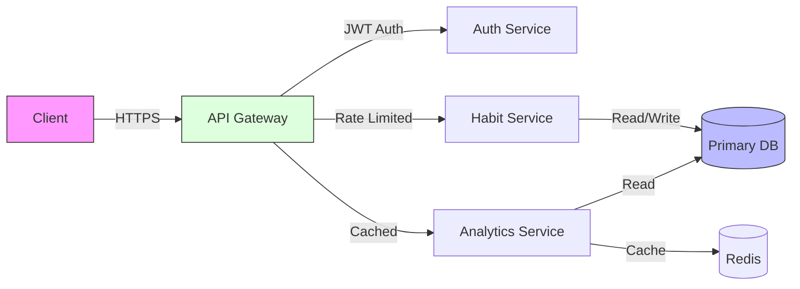

### 3.3.2 Interface Specifications

| Endpoint | Method | Purpose | Rate Limit |
|----------|--------|---------|------------|
| /api/v1/habits | GET | List habits | 100/min |
| /api/v1/habits | POST | Create habit | 60/min |
| /api/v1/habits/{id} | PUT | Update habit | 60/min |
| /api/v1/habits/{id}/logs | POST | Log completion | 120/min |
| /api/v1/analytics | GET | Get insights | 30/min |

### 3.3.3 Integration Requirements

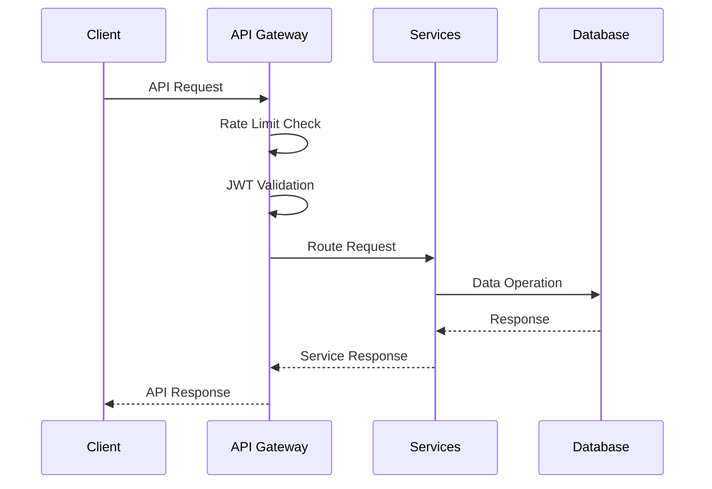

# 4. TECHNOLOGY STACK

## 4.1 PROGRAMMING LANGUAGES

| Platform | Language | Version | Justification |
|----------|----------|---------|---------------|
| Frontend | TypeScript | 4.9.x | - Strong typing for large-scale applications<br>- Enhanced IDE support<br>- Better maintainability and refactoring |
| Backend | Node.js | 18.x LTS | - JavaScript ecosystem consistency<br>- Excellent async performance<br>- Rich package ecosystem |
| Build Tools | JavaScript | ES2022 | - Native build tool support<br>- Webpack/Babel compatibility<br>- Cross-platform support |

## 4.2 FRAMEWORKS & LIBRARIES

### 4.2.1 Core Frameworks

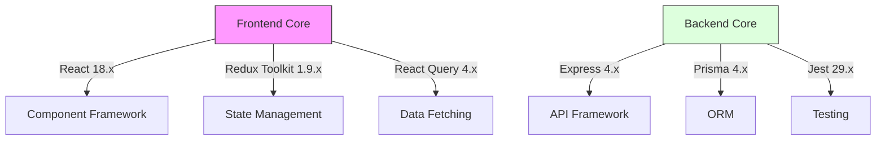

### 4.2.2 Supporting Libraries

| Category | Library | Version | Purpose |
|----------|---------|---------|----------|
| UI Components | Material UI | 5.x | Component library with accessibility support |
| Data Visualization | Chart.js | 4.x | Interactive charts and graphs |
| Form Management | React Hook Form | 7.x | Performant form validation and handling |
| API Client | Axios | 1.x | HTTP client with interceptors |
| Documentation | Swagger UI | 4.x | API documentation and testing |
| Monitoring | Sentry | Latest | Error tracking and performance |

## 4.3 DATABASES & STORAGE

### 4.3.1 Data Architecture

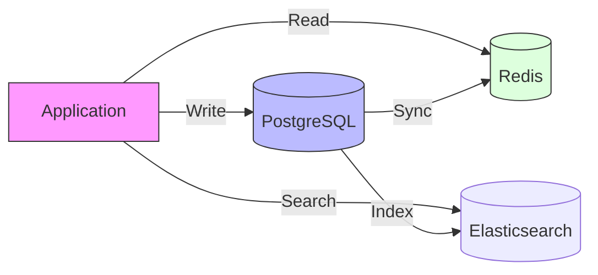

### 4.3.2 Storage Solutions

| Type | Technology | Version | Use Case |
|------|------------|---------|----------|
| Primary Database | PostgreSQL | 14.x | Transactional data storage |
| Cache Layer | Redis | 6.x | Session and application cache |
| Search Engine | Elasticsearch | 8.x | Full-text search capabilities |
| File Storage | S3-compatible | - | User uploads and exports |

## 4.4 THIRD-PARTY SERVICES

| Service | Provider | Purpose | Integration |
|---------|----------|----------|-------------|
| Authentication | Auth0 | User authentication | OAuth 2.0/OIDC |
| Email | SendGrid | Transactional emails | REST API |
| Analytics | Google Analytics 4 | Usage tracking | JavaScript SDK |
| CDN | Cloudflare | Content delivery | DNS/Proxy |
| Monitoring | Datadog | System monitoring | Agent/API |

## 4.5 DEVELOPMENT & DEPLOYMENT

### 4.5.1 Development Pipeline

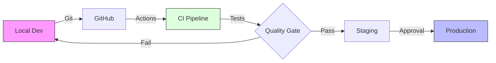

### 4.5.2 Infrastructure Tools

| Category | Tool | Version | Purpose |
|----------|------|---------|----------|
| Containerization | Docker | 20.x | Application packaging |
| Orchestration | Kubernetes | 1.24.x | Container orchestration |
| IaC | Terraform | 1.3.x | Infrastructure provisioning |
| CI/CD | GitHub Actions | Latest | Automation pipeline |
| Monitoring | Prometheus | 2.x | Metrics collection |

### 4.5.3 Development Tools

| Tool | Version | Purpose |
|------|---------|----------|
| VS Code | Latest | Primary IDE |
| ESLint | 8.x | Code linting |
| Prettier | 2.x | Code formatting |
| Husky | 8.x | Git hooks |
| Jest | 29.x | Testing framework |
| Webpack | 5.x | Build tooling |

# 5. SYSTEM DESIGN

## 5.1 USER INTERFACE DESIGN

### 5.1.1 Layout Structure

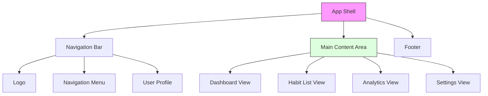

### 5.1.2 Component Hierarchy

| Component | Children | Functionality |
|-----------|----------|---------------|
| AppShell | Navigation, MainContent, Footer | Layout container, theme management |
| Navigation | Logo, Menu, UserProfile | App navigation, authentication status |
| Dashboard | HabitGrid, ProgressSummary, QuickActions | Overview of habits and progress |
| HabitList | HabitCard, CreateHabitForm, FilterControls | CRUD operations for habits |
| Analytics | Charts, Heatmaps, StatisticCards | Data visualization and insights |
| Settings | PreferenceForm, NotificationSettings | User configuration |

### 5.1.3 Responsive Behavior

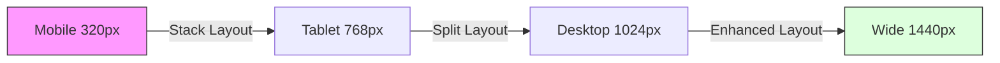

## 5.2 DATABASE DESIGN

### 5.2.1 Schema Design

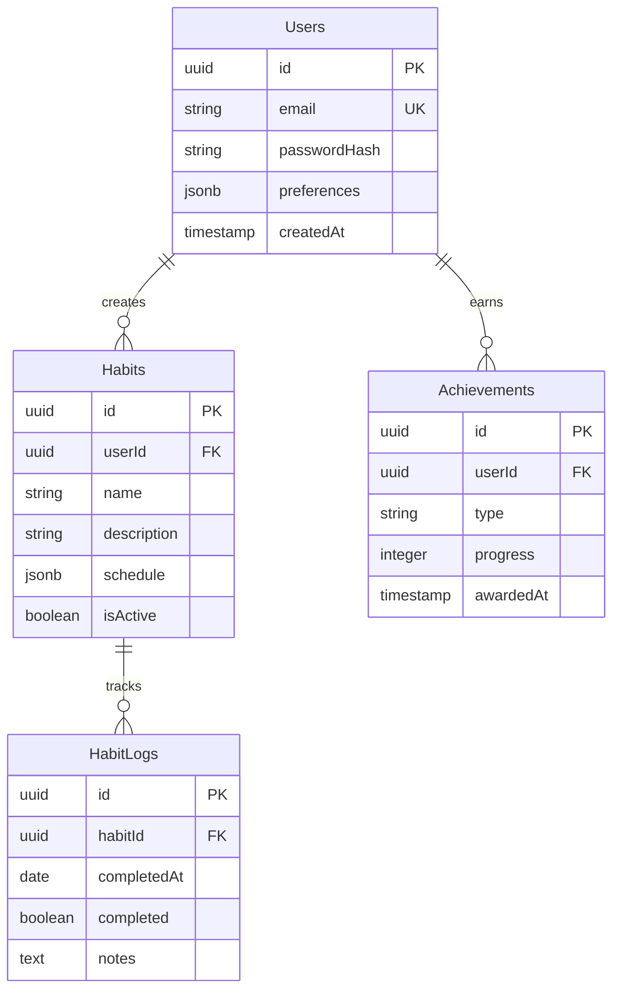

### 5.2.2 Data Access Patterns

| Operation | Access Pattern | Caching Strategy |
|-----------|---------------|------------------|
| Habit List | User ID index scan | Redis, 5 min TTL |
| Daily Check-in | Habit ID point lookup | No cache |
| Analytics | Materialized view | Redis, 1 hour TTL |
| User Profile | User ID point lookup | Redis, 15 min TTL |
| Achievements | Batch processing | Redis, 30 min TTL |

## 5.3 API DESIGN

### 5.3.1 REST Endpoints

| Endpoint | Method | Purpose | Request/Response |
|----------|---------|---------|------------------|
| /api/v1/habits | GET | List habits | Paginated habit list |
| /api/v1/habits | POST | Create habit | New habit object |
| /api/v1/habits/{id} | PUT | Update habit | Updated habit object |
| /api/v1/habits/{id}/logs | POST | Log completion | Completion status |
| /api/v1/analytics | GET | Get insights | Analytics data |

### 5.3.2 API Flow

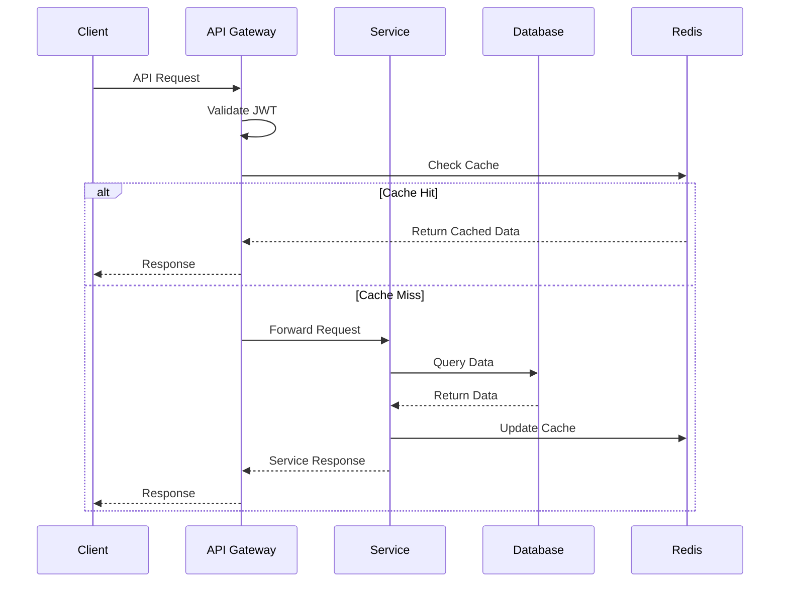

### 5.3.3 WebSocket Events

| Event | Direction | Purpose | Payload |
|-------|-----------|---------|---------|
| habit.completed | Server→Client | Real-time updates | Habit completion data |
| streak.achieved | Server→Client | Achievement notification | Streak milestone data |
| stats.updated | Server→Client | Analytics refresh | Updated statistics |
| user.activity | Client→Server | User presence | Activity timestamp |

# 6. USER INTERFACE DESIGN

## 6.1 WIREFRAME KEY

| Symbol | Meaning |
|--------|---------|
| [#] | Dashboard/Menu |
| [@] | User Profile |
| [+] | Add/Create |
| [x] | Close/Delete |
| [?] | Help/Info |
| [=] | Settings |
| [!] | Alert/Warning |
| [<] [>] | Navigation |
| [ ] | Checkbox |
| (...) | Radio Button |
| [...] | Text Input |
| [v] | Dropdown |
| [====] | Progress Bar |

## 6.2 MAIN DASHBOARD

```
+----------------------------------------------------------+
|  [#] Habit Tracker                              [@] [=]   |
+----------------------------------------------------------+
|                                                           |
|  Today's Habits                     Quick Stats           |
|  +------------------------+         +------------------+   |
|  | [ ] Morning Meditation |         | Current Streaks  |   |
|  | [x] Daily Exercise    |         | ================ |   |
|  | [ ] Read 30 Minutes   |         | 5 Active Habits  |   |
|  | [+] Add New Habit     |         | 12 Day Streak    |   |
|  +------------------------+         +------------------+   |
|                                                           |
|  Weekly Progress                                         |
|  +--------------------------------------------------+   |
|  | [=========>          ] 45% Complete               |   |
|  | M  T  W  T  F  S  S                              |   |
|  | ●  ●  ●  ○  ○  -  -                              |   |
|  +--------------------------------------------------+   |
|                                                           |
|  Achievement Progress                                    |
|  +--------------------------------------------------+   |
|  | [*] 7 Day Streak - In Progress [====    ] 80%     |   |
|  | [*] Complete All Habits - Today [==      ] 40%    |   |
|  +--------------------------------------------------+   |
+----------------------------------------------------------+
```

## 6.3 HABIT CREATION FORM

```
+----------------------------------------------------------+
|  [#] Create New Habit                          [x] Close   |
+----------------------------------------------------------+
|                                                           |
|  Habit Name:                                             |
|  [Enter habit name here................................] |
|                                                           |
|  Description:                                            |
|  [Enter description here................................] |
|                                                           |
|  Frequency:                                              |
|  (•) Daily                                               |
|  ( ) Weekly                                              |
|  ( ) Custom                                              |
|                                                           |
|  Reminder Time:                                          |
|  [v] Select Time                                         |
|                                                           |
|  Tags:                                                   |
|  [Health] [Productivity] [+]                             |
|                                                           |
|  [?] Need help setting up your habit?                    |
|                                                           |
|  +--------------------------------------------------+   |
|  |          [Cancel]           [Save Habit]          |   |
|  +--------------------------------------------------+   |
+----------------------------------------------------------+
```

## 6.4 ANALYTICS VIEW

```
+----------------------------------------------------------+
|  [#] Habit Analytics                          [@] [=]     |
+----------------------------------------------------------+
|                                                           |
|  Time Period: [v] Last 30 Days        [Export Data] [?]  |
|                                                           |
|  Completion Heatmap                                      |
|  +--------------------------------------------------+   |
|  |  M   T   W   T   F   S   S                       |   |
|  | ███ ███ ▓▓▓ ░░░ ░░░ ▓▓▓ ███  Week 1             |   |
|  | ███ ▓▓▓ ███ ███ ▓▓▓ ░░░ ░░░  Week 2             |   |
|  | ▓▓▓ ███ ███ ███ ███ ███ ▓▓▓  Week 3             |   |
|  | ███ ███ ███ ███ ███ ███ ███  Week 4             |   |
|  +--------------------------------------------------+   |
|  Legend: ███ Complete  ▓▓▓ Partial  ░░░ Missed          |
|                                                           |
|  Success Rate by Habit                                   |
|  +--------------------------------------------------+   |
|  | Morning Meditation [==================>  ] 90%     |   |
|  | Daily Exercise     [============>      ] 60%      |   |
|  | Read 30 Minutes    [=================>  ] 85%     |   |
|  +--------------------------------------------------+   |
|                                                           |
|  Longest Streaks                                        |
|  +--------------------------------------------------+   |
|  | 1. Morning Meditation  21 days                    |   |
|  | 2. Daily Exercise     14 days                     |   |
|  | 3. Read 30 Minutes    18 days                     |   |
|  +--------------------------------------------------+   |
+----------------------------------------------------------+
```

## 6.5 SETTINGS PANEL

```
+----------------------------------------------------------+
|  [#] Settings                                 [x] Close    |
+----------------------------------------------------------+
|                                                           |
|  Notification Preferences                                 |
|  +--------------------------------------------------+   |
|  | [x] Daily Reminders                               |   |
|  | [ ] Weekly Summary                                |   |
|  | [x] Achievement Alerts                            |   |
|  | [ ] Streak Warnings                               |   |
|  +--------------------------------------------------+   |
|                                                           |
|  Theme:                                                  |
|  (•) Light                                               |
|  ( ) Dark                                                |
|  ( ) System Default                                      |
|                                                           |
|  Time Zone: [v] (UTC-08:00) Pacific Time                 |
|                                                           |
|  Data & Privacy                                          |
|  +--------------------------------------------------+   |
|  | [Export All Data]                                 |   |
|  | [Delete Account]                                  |   |
|  +--------------------------------------------------+   |
|                                                           |
|  [!] Account deletion is permanent                       |
|                                                           |
|  +--------------------------------------------------+   |
|  |          [Cancel]           [Save Changes]        |   |
|  +--------------------------------------------------+   |
+----------------------------------------------------------+
```

## 6.6 RESPONSIVE BEHAVIOR

The interface adapts to different screen sizes following these breakpoints:

### Mobile View (320px - 767px)
- Single column layout
- Collapsible navigation menu
- Stacked habit cards
- Simplified analytics views
- Touch-optimized input controls

### Tablet View (768px - 1023px)
- Two column layout where appropriate
- Side navigation panel
- Grid layout for habit cards
- Interactive charts with touch support
- Expanded analytics views

### Desktop View (1024px+)
- Full multi-column layout
- Persistent navigation
- Advanced analytics dashboards
- Keyboard shortcuts
- Hover states and tooltips

## 6.7 ACCESSIBILITY FEATURES

- ARIA labels on all interactive elements
- Keyboard navigation support
- High contrast mode support
- Screen reader compatibility
- Focus indicators
- Scalable text (up to 200%)
- Alternative text for all visual elements
- Semantic HTML structure

# 7. SECURITY CONSIDERATIONS

## 7.1 AUTHENTICATION AND AUTHORIZATION

### 7.1.1 Authentication Flow

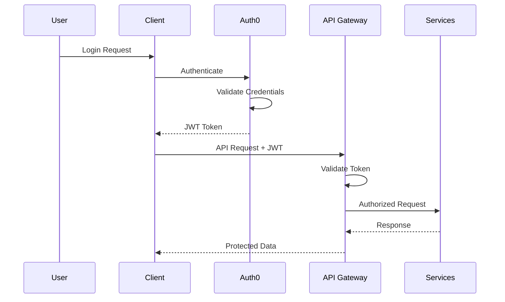

### 7.1.2 Authorization Matrix

| Role | Habits | Analytics | Settings | Admin |
|------|--------|-----------|----------|--------|
| User | CRUD own | View own | Manage own | None |
| Premium | CRUD own | Advanced analytics | Manage own | None |
| Admin | View all | View all | Manage all | Full access |
| System | N/A | Aggregate | Configure | Full access |

### 7.1.3 Authentication Methods

| Method | Implementation | Security Level |
|--------|----------------|----------------|
| Email/Password | Auth0 + Bcrypt | Primary |
| OAuth 2.0 | Google, Facebook | Secondary |
| MFA | TOTP via Auth0 | Optional Enhancement |
| API Keys | JWT with RS256 | Service Access |
| Session | Redis + HTTP Only Cookies | Web Session |

## 7.2 DATA SECURITY

### 7.2.1 Encryption Standards

| Data State | Method | Key Size | Implementation |
|------------|--------|----------|----------------|
| In Transit | TLS 1.3 | 256-bit | Nginx/CloudFlare |
| At Rest | AES-256-GCM | 256-bit | PostgreSQL |
| Backups | AES-256-CBC | 256-bit | Automated Scripts |
| API Tokens | RS256 | 2048-bit | Auth0 |
| Passwords | Bcrypt | - | Auth0/Local |

### 7.2.2 Data Classification

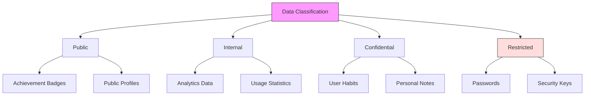

## 7.3 SECURITY PROTOCOLS

### 7.3.1 Security Headers

| Header | Value | Purpose |
|--------|--------|---------|
| Content-Security-Policy | strict-dynamic | XSS Protection |
| X-Frame-Options | DENY | Clickjacking Prevention |
| Strict-Transport-Security | max-age=31536000 | HTTPS Enforcement |
| X-Content-Type-Options | nosniff | MIME Type Protection |
| X-XSS-Protection | 1; mode=block | XSS Protection |
| Referrer-Policy | strict-origin-when-cross-origin | Privacy Protection |

### 7.3.2 Security Monitoring

```mermaid
graph LR
    A[Security Events] --> B[Logging Service]
    B --> C[ELK Stack]
    C --> D[Alert System]
    D --> E[Security Team]
    D --> F[Automated Response]
    
    B --> G[Audit Logs]
    G --> H[Compliance Reports]
    
    style A fill:#f9f,stroke:#333
    style D fill:#fdd,stroke:#333
    style H fill:#dfd,stroke:#333
```

### 7.3.3 Security Controls

| Control Type | Implementation | Monitoring |
|--------------|----------------|------------|
| Rate Limiting | 100 req/min per IP | Real-time |
| Input Validation | Server-side validation | Error logs |
| SQL Injection | Prepared statements | Query logs |
| Session Management | 24h expiry, secure flags | Session logs |
| File Upload | Type validation, size limits | Upload logs |
| Error Handling | Sanitized responses | Error tracking |

### 7.3.4 Incident Response

| Phase | Actions | Responsibility |
|-------|---------|----------------|
| Detection | Monitor security alerts | Security System |
| Analysis | Assess threat level | Security Team |
| Containment | Isolate affected systems | DevOps Team |
| Eradication | Remove security threats | Security Team |
| Recovery | Restore normal operation | DevOps Team |
| Post-Incident | Review and improve | Security Team |

### 7.3.5 Compliance Requirements

| Requirement | Implementation | Validation |
|-------------|----------------|------------|
| GDPR | Data encryption, consent management | Annual audit |
| CCPA | Privacy controls, data export | Quarterly review |
| HIPAA | Access controls, audit trails | Monthly check |
| PCI DSS | Payment data isolation | Annual certification |
| SOC 2 | Security monitoring, policies | Continuous monitoring |

# 8. INFRASTRUCTURE

## 8.1 DEPLOYMENT ENVIRONMENT

```mermaid
graph TD
    A[Production Environment] --> B[AWS Cloud]
    A --> C[CloudFlare CDN]
    
    B --> D[Primary Region: US-West-2]
    B --> E[DR Region: US-East-1]
    
    D --> F[Production Cluster]
    E --> G[DR Cluster]
    
    F --> H[Web Tier]
    F --> I[Application Tier]
    F --> J[Data Tier]
    
    style A fill:#f9f,stroke:#333
    style B fill:#dfd,stroke:#333
    style D fill:#bbf,stroke:#333
```

| Environment | Purpose | Configuration |
|-------------|---------|---------------|
| Development | Local development | Docker Compose, local resources |
| Staging | Pre-production testing | K8s cluster, replicated services |
| Production | Live environment | Multi-AZ K8s, high availability |
| DR | Disaster recovery | Cross-region replication |

## 8.2 CLOUD SERVICES

| Service | Provider | Purpose | Justification |
|---------|----------|---------|---------------|
| Compute | AWS EKS | Container orchestration | Managed Kubernetes with auto-scaling |
| Database | AWS RDS | PostgreSQL hosting | Automated backups, replication |
| Cache | AWS ElastiCache | Redis cluster | In-memory caching, session management |
| Storage | AWS S3 | Static assets, backups | Durability, CDN integration |
| CDN | CloudFlare | Content delivery | Global edge network, DDoS protection |
| DNS | Route 53 | DNS management | AWS integration, health checks |
| Monitoring | CloudWatch | System monitoring | AWS native monitoring, alerting |

## 8.3 CONTAINERIZATION

```mermaid
graph LR
    A[Base Image] --> B[Node.js Alpine]
    B --> C[Dependencies]
    C --> D[Application Code]
    D --> E[Final Image]
    
    subgraph Container Structure
    F[Nginx] --> G[React App]
    H[Node.js] --> I[API Services]
    end
    
    style A fill:#f9f,stroke:#333
    style E fill:#dfd,stroke:#333
```

| Component | Image | Size Limit | Configuration |
|-----------|-------|------------|---------------|
| Frontend | nginx:alpine | 100MB | Multi-stage build |
| Backend | node:18-alpine | 200MB | Production optimized |
| Database | postgres:14-alpine | 300MB | Custom configuration |
| Cache | redis:6-alpine | 50MB | Production settings |

## 8.4 ORCHESTRATION

```mermaid
graph TD
    A[EKS Cluster] --> B[Node Groups]
    B --> C[System Pods]
    B --> D[Application Pods]
    
    C --> E[Monitoring]
    C --> F[Ingress]
    C --> G[Cert Manager]
    
    D --> H[Frontend]
    D --> I[Backend Services]
    D --> J[Jobs]
    
    style A fill:#f9f,stroke:#333
    style B fill:#dfd,stroke:#333
    style D fill:#bbf,stroke:#333
```

| Component | Configuration | Scaling Policy |
|-----------|--------------|----------------|
| Node Groups | t3.medium | 3-10 nodes |
| Frontend | 2-5 pods | CPU based |
| Backend | 3-10 pods | Request based |
| Database | Multi-AZ | Manual |
| Cache | 3 node cluster | Memory based |

## 8.5 CI/CD PIPELINE

```mermaid
flowchart LR
    A[Source] -->|Push| B[GitHub]
    B -->|Trigger| C[GitHub Actions]
    
    C -->|Build| D[Test]
    D -->|Pass| E[Build Images]
    E -->|Push| F[ECR]
    
    F -->|Deploy| G[Staging]
    G -->|Approve| H[Production]
    
    style A fill:#f9f,stroke:#333
    style C fill:#dfd,stroke:#333
    style H fill:#bbf,stroke:#333
```

| Stage | Tools | Actions |
|-------|-------|---------|
| Source Control | GitHub | Code hosting, version control |
| CI Pipeline | GitHub Actions | Build, test, security scan |
| Artifact Storage | AWS ECR | Container image registry |
| Deployment | ArgoCD | Kubernetes deployments |
| Monitoring | Prometheus/Grafana | Performance monitoring |

### Pipeline Stages

1. Code Validation
   - Linting
   - Unit tests
   - Security scanning
   - Code coverage

2. Build Process
   - Multi-stage Docker builds
   - Image optimization
   - Version tagging
   - Vulnerability scanning

3. Deployment Process
   - Staging deployment
   - Integration tests
   - Manual approval
   - Production rollout
   - Health checks

4. Post-Deployment
   - Smoke tests
   - Performance monitoring
   - Alert configuration
   - Documentation updates

# 9. APPENDICES

## 9.1 ADDITIONAL TECHNICAL INFORMATION

### 9.1.1 Browser Support Matrix

| Browser | Minimum Version | Progressive Enhancement Features |
|---------|----------------|--------------------------------|
| Chrome | 90+ | Service Workers, Push API, Background Sync |
| Firefox | 88+ | Service Workers, Push API |
| Safari | 14+ | Service Workers, Limited PWA Support |
| Edge | 90+ | Full PWA Support, Background Sync |
| Opera | 76+ | Full PWA Support |

### 9.1.2 Performance Metrics

```mermaid
graph LR
    A[Performance Metrics] --> B[Core Web Vitals]
    B --> C[LCP < 2.5s]
    B --> D[FID < 100ms]
    B --> E[CLS < 0.1]
    
    A --> F[Custom Metrics]
    F --> G[API Response < 200ms]
    F --> H[TTI < 3.5s]
    F --> I[Bundle Size < 300KB]
    
    style A fill:#f9f,stroke:#333
    style B fill:#dfd,stroke:#333
    style F fill:#bbf,stroke:#333
```

## 9.2 GLOSSARY

| Term | Definition |
|------|------------|
| Core Web Vitals | Google's metrics for web performance measurement |
| Dependency Injection | Design pattern where components receive dependencies externally |
| Hot Module Replacement | Development feature allowing real-time code updates without refresh |
| Hydration | Process of attaching event listeners to server-rendered HTML |
| Lazy Loading | Technique to defer loading of non-critical resources |
| Memoization | Optimization technique caching results of expensive operations |
| Middleware | Software layer handling communication between application components |
| Server-Side Rendering | Pre-rendering React components on the server |
| Tree Shaking | Dead code elimination in modern JavaScript bundlers |
| Virtual DOM | Memory representation of UI used by React for efficient updates |

## 9.3 ACRONYMS

| Acronym | Full Form |
|---------|-----------|
| API | Application Programming Interface |
| CDN | Content Delivery Network |
| CLS | Cumulative Layout Shift |
| CORS | Cross-Origin Resource Sharing |
| CSP | Content Security Policy |
| DI | Dependency Injection |
| FID | First Input Delay |
| HMR | Hot Module Replacement |
| HTTPS | Hypertext Transfer Protocol Secure |
| JWT | JSON Web Token |
| LCP | Largest Contentful Paint |
| MFA | Multi-Factor Authentication |
| ORM | Object-Relational Mapping |
| PWA | Progressive Web Application |
| RBAC | Role-Based Access Control |
| REST | Representational State Transfer |
| SSR | Server-Side Rendering |
| TTI | Time to Interactive |
| UI/UX | User Interface/User Experience |
| XSS | Cross-Site Scripting |

## 9.4 DEVELOPMENT ENVIRONMENT SETUP

```mermaid
flowchart TD
    A[Development Setup] --> B[Prerequisites]
    B --> C[Node.js 18.x]
    B --> D[Docker Desktop]
    B --> E[Git]
    
    A --> F[Configuration]
    F --> G[Environment Variables]
    F --> H[SSL Certificates]
    F --> I[Database Setup]
    
    A --> J[Development Tools]
    J --> K[VS Code Extensions]
    J --> L[Chrome DevTools]
    J --> M[Postman]
    
    style A fill:#f9f,stroke:#333
    style F fill:#dfd,stroke:#333
    style J fill:#bbf,stroke:#333
```

## 9.5 ERROR CODES AND HANDLING

| Code Range | Category | Example |
|------------|----------|---------|
| 1000-1999 | Authentication | 1001: Invalid credentials |
| 2000-2999 | Authorization | 2001: Insufficient permissions |
| 3000-3999 | Validation | 3001: Invalid input format |
| 4000-4999 | Business Logic | 4001: Habit limit exceeded |
| 5000-5999 | System | 5001: Database connection error |
| 6000-6999 | External Services | 6001: Third-party API failure |